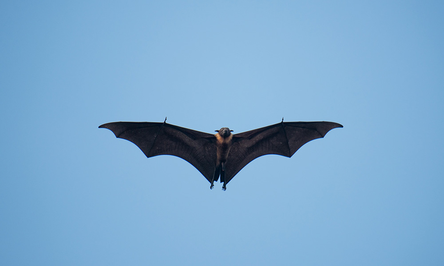
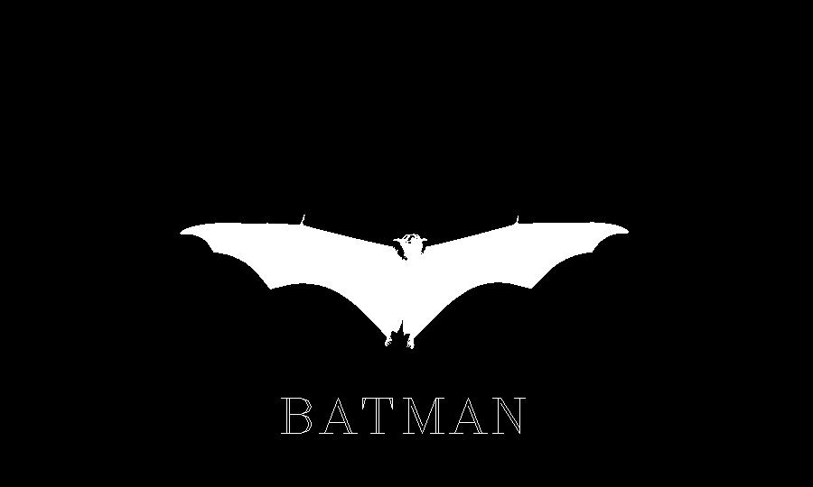

# Assignment4-2-1 Batman logo 

In the first problem, a colored picture of batman is converted to Black-White picture. In addition,"BATMAN" is written in the bottom of the batman's picture.


The original image is:




The logo is:




## How to run

You can run the following code to enjoy it . 


```
python HW4-2-1_logo.py
```
