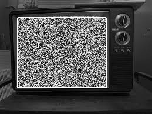

# Assignment 4-2-2: TV Noise
In the second problem a gif which is about an old tv with nose is designed. The result is shown below:



## How to run

You can run the following code to enjoy it . 


```
python HW4-2-2_noise.py
```
