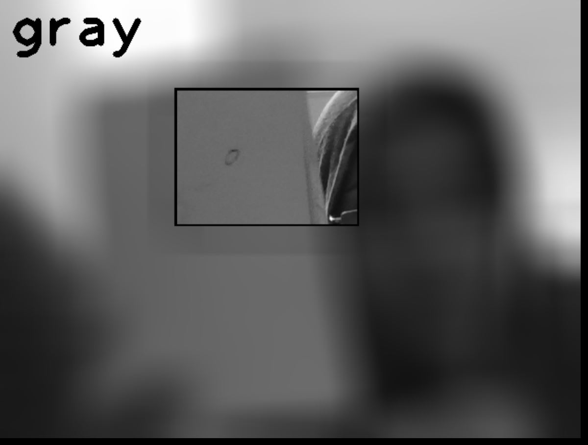

# 2. Color Detector 

In the fourth problem is a color detection project. There is a rectangle in the middle of the picture where you can put the desired object in that area to detect its color:

write a color detector using webcam,that can detects "White","Gray" and "Black" colors.



## How to run

You can run the following code to enjoy it . 


```
python HW4-2-4_colordetector.py
```