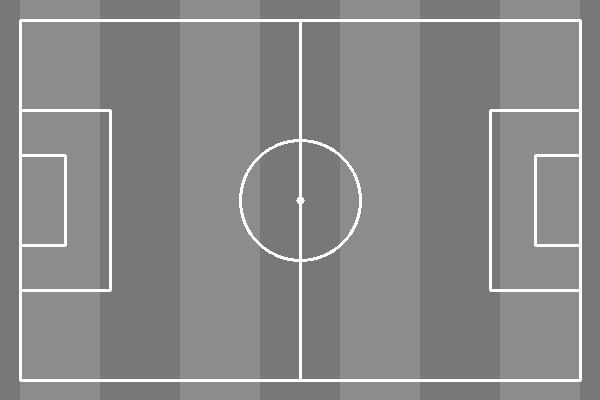

# Assignment 4-3-1 Football pitch 

In the first problem, a black-and- white football pitch is designed. 

The designed picture is:




## How to run

You can run the following code to enjoy it . 


```
python HW4-3-1_footballpitch.py
```
