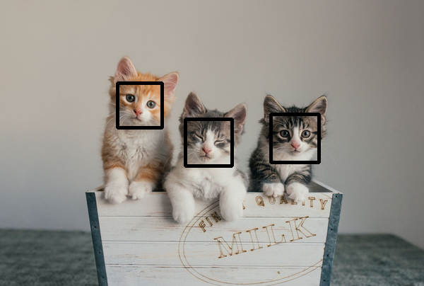

# Assignment 4-3-2 Cat detection

In the second problem, existed cats in the image are detected and number of them is shown. In addition, the face of cats is shown by rectangle.

The result is:




## How to run

You can run the following code to enjoy it . 


```
python HW4-3-2_cat.py
```
