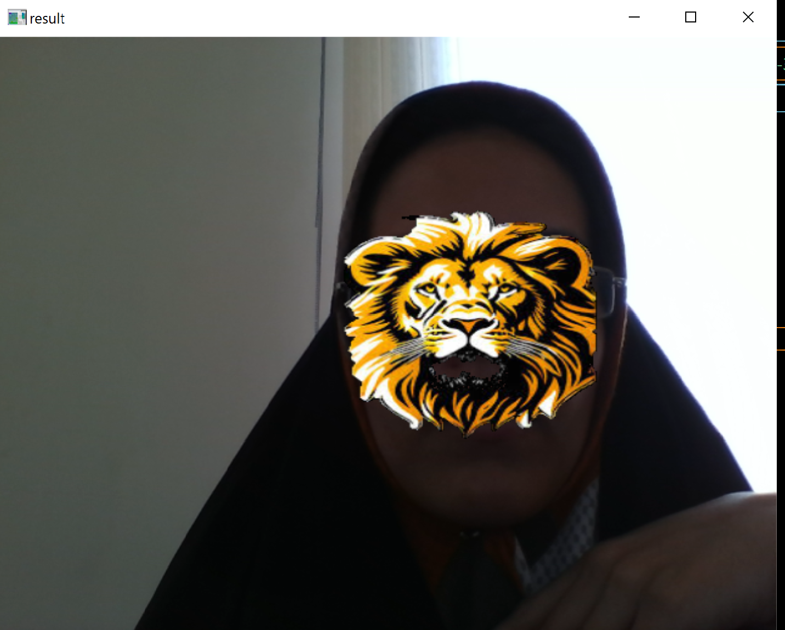
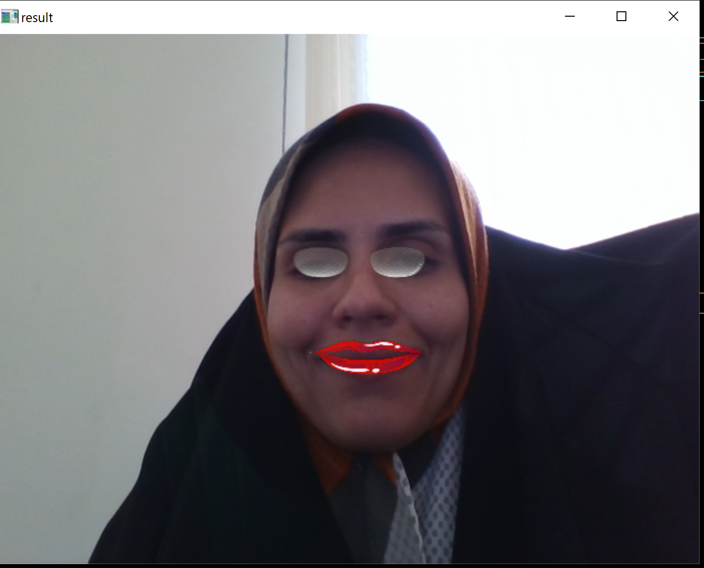
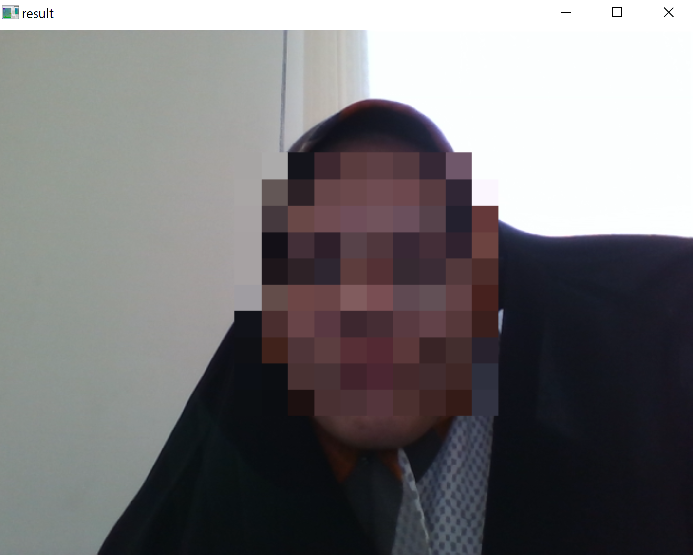
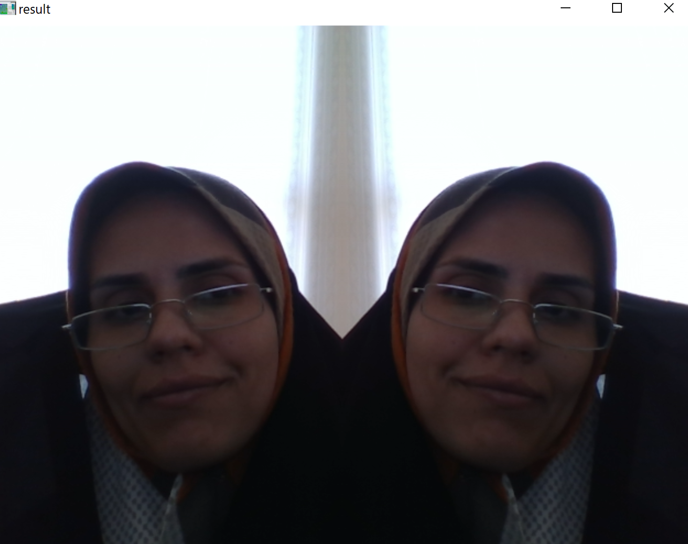

# Assignment 4-3-3 Face filter

In the third problem, a program is writen to open webcam and apply some filters on your face:

Press 1 on keyboard to set a non-square sticker on your face like bellow :




Press 2 on keyboard to set stickers on your eyes and lips like bellow :



Press 3 on keyboard to set a chess-board face like bellow :



Press 4 on keyboard to set a mirror filter like bellow :




## How to run

You can run the following code to enjoy it . 


```
python HW4-3-3_facefilters.py
```
