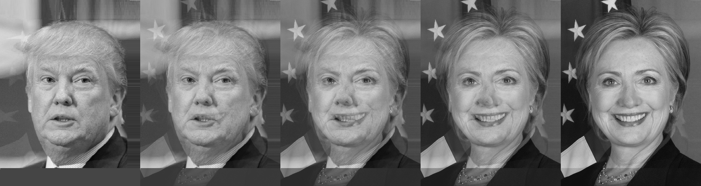

# Assignment 4-4-1: Face morphing
In the first problem, one face is morphed to another face and 5 different photo are generated from 2 photos. The result is shown below:



## How to run

You can run the following code to enjoy it . 


```
python HW4-4-1_facemorphong.py
```
