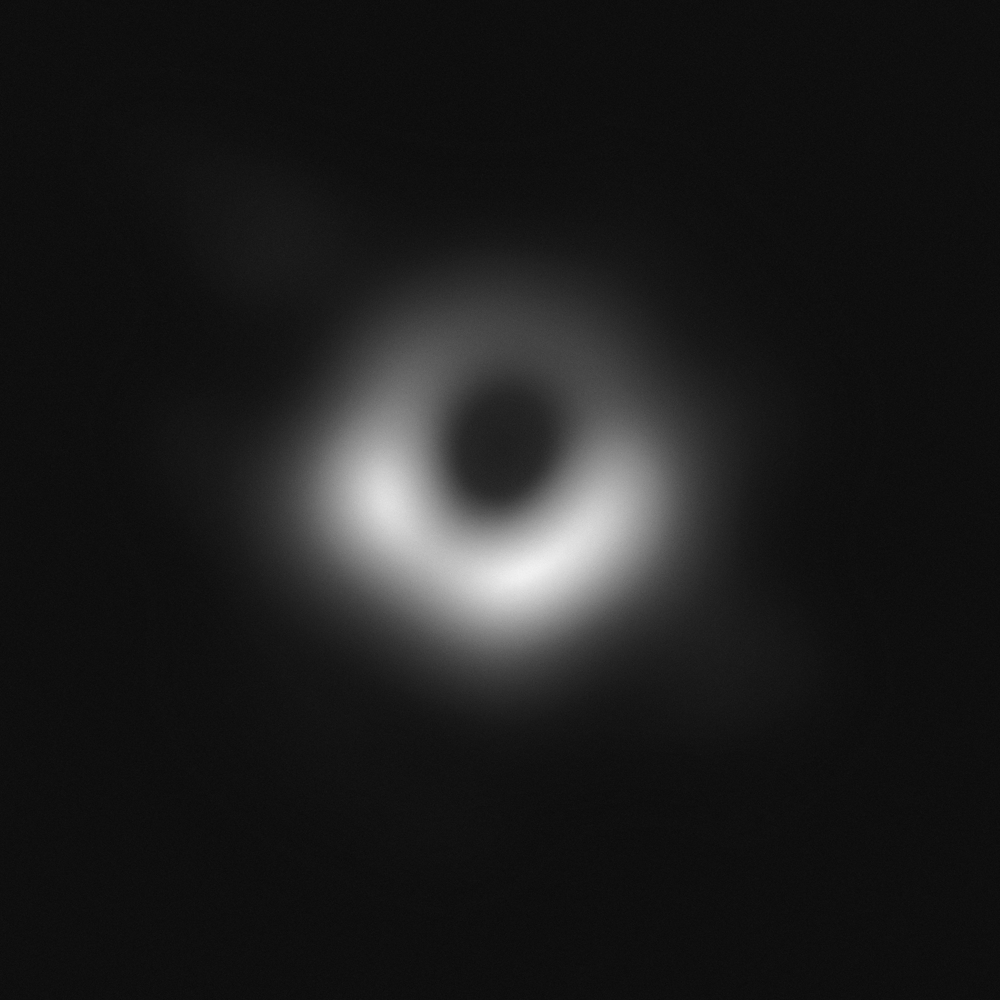

# Assignment 4-4-2: Black hole
In the second problem, the noise of each pictures exited in each folder is reduced and four pictures are combined. The result is shown bellow.



## How to run

You can run the following code to enjoy it . 


```
python HW4-4-2_blackhole.py
```
