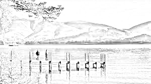

# Assignment 4-4-2: Photo to sketch
In the third problem, a photo is converted to the sketch . The result is shown bellow.



## How to run

You can run the following code to enjoy it . 


```
python HW4-4-3_photosketch.py