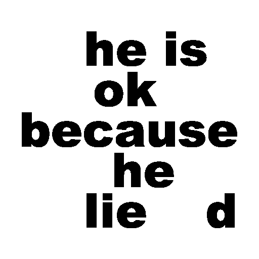

# Assignment 4-4-4: Secret text
In the fourth problem, the secret text of two texts is found. 

The result is shown bellow.



## How to run

You can run the following code to enjoy it . 


```
python HW4-4-4_secrettext.py