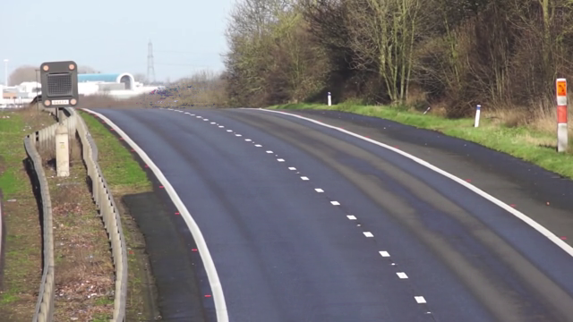

# Assignment 4-4-5: Background estimation
In the fifth problem, the average of video frames is calculated to create an image of empty road, without cars.


The result is shown bellow.



## How to run

You can run the following code to enjoy it . 


```
python HW4-4-5_background.py