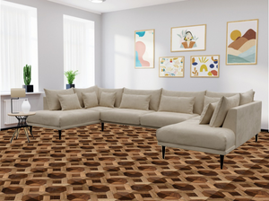

# Assignment 4-4-6: Virtual decoration
In the sixth problem, we use mask concept to apply new floor in the room.


The result is shown bellow.



## How to run

You can run the following code to enjoy it . 


```
python HW4-4-6_vitualdecoration.py